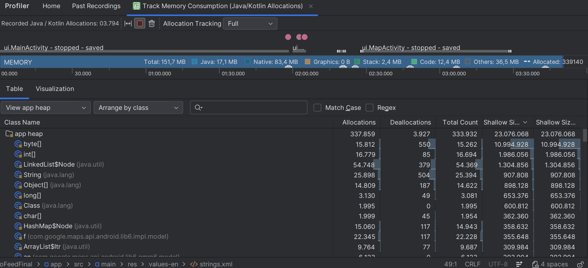

# 🧭 GeoFeedFinal

> Proyecto desarrollado en **java + android (xml + views)**  
> Asignatura: **programacion dirigida a eventos**

---

## 📌 Que es este proyecto?

GeoFeedFinal es una aplicacion android sencilla cuyo objetivo es aplicar los conceptos fundamentales de la programacion dirigida a eventos en un entorno real.

La app permite:

- 📍 Mantener una lista de lugares
- 📄 Ver el detalle de cada lugar
- ⭐ Marcar y desmarcar favoritos
- 🗺 Mostrar el lugar en un mapa (google maps)
- 🔔 Programar un recordatorio diario
- 🌍 Trabajar con localizacion e idiomas
- 🧠 Cargar datos en segundo plano sin bloquear la interfaz

Todo el flujo esta basado en:

- Eventos de interfaz (clicks, cambios de estado)
- Intents explicitos
- Fragmentos
- Persistencia local
- Manejo de permisos
- Ciclo de vida de activities

---

## 🎯 Objetivo academico

Este proyecto no busca ser una app comercial, sino demostrar dominio de:

- Gestion de eventos en android
- Comunicacion entre activities mediante intents
- Uso de fragment como componente reutilizable
- Persistencia con room
- Almacenamiento de preferencias con sharedpreferences
- Tareas en segundo plano
- Notificaciones programadas
- Localizacion y formato regional
- Uso basico de android profiler

Todo ajustado estrictamente a las restricciones del enunciado:

- lenguaje: java
- ui: xml + views
- uso obligatorio de room y sharedpreferences
- fragment para mapa

---

## 🏗 Estructura del proyecto

La arquitectura es sencilla y clara, separada por responsabilidad:

```text
com.juanma.geofeedfinal
│
├── data/        → modelo + room
│   ├── Place.java
│   ├── PlaceEntity.java
│   ├── PlaceDao.java
│   ├── AppDatabase.java
│   └── PlaceRepository.java
│
├── ui/          → interfaz y navegacion
│   ├── MainActivity.java
│   ├── DetailActivity.java
│   ├── MapActivity.java
│   ├── MapFragment.java
│   └── PlaceAdapter.java
│
└── utils/       → utilidades
    ├── PrefsManager.java
    ├── JsonLoader.java
    ├── NotificationHelper.java
    └── ReminderReceiver.java
```   
- data contiene la capa de persistencia (room).

- ui contiene las pantallas y la navegacion.

- utils contiene clases auxiliares (json, notificaciones, preferencias).

- La separacion esta pensada para mantener responsabilidades claras y facilita el mantenimiento.

---

# ✅ Requerimientos Implementados

A continuación detallo cómo se han cubierto los puntos del enunciado, explicando qué se ha hecho y por qué.

---

## 4.1 Lista de Lugares (RecyclerView)

✔ Implementado en `MainActivity`  
✔ Uso de `RecyclerView` + `Adapter` personalizado (`PlaceAdapter`)  
✔ Datos cargados inicialmente desde `assets/places.json`  
✔ Persistencia posterior en base de datos Room

### Qué se ha hecho

- Se implementa un `RecyclerView` como lista principal.
- Cada elemento muestra:
    - Icono
    - Nombre
    - Tipo
    - Indicador visual si es favorito
- Se ha separado correctamente la lógica en:
    - Adapter (renderizado)
    - Repository (acceso a datos)
    - Room (persistencia)

### Conceptos de Programación Dirigida a Eventos aplicados

- `OnClickListener` para detectar selección de item.
- Reacción inmediata de la UI ante cambios.
- Patrón observable implícito (actualización tras volver de otra Activity).

---

## 4.2 Navegación: Activities + Intents

✔ Mínimo 2 Activities  
✔ Uso de Intent explícito  
✔ Paso de datos mediante `putExtra()`

### Implementación

- `MainActivity` → Lista
- `DetailActivity` → Detalle
- `MapActivity` → Mapa

La navegación se realiza mediante:

```java
Intent intent = new Intent(this, DetailActivity.class);
intent.putExtra("PLACE_ID", placeId);
startActivity(intent);
```
Se pasa el `id` del lugar seleccionado para cargar su información desde Room.

### Justificación Técnica

Se ha optado por `Intent` explícito para cumplir el enunciado y mantener control total sobre la navegación entre pantallas.

El paso del identificador en lugar del objeto completo permite:

- Evitar acoplamiento entre Activities.
- Garantizar que los datos siempre se cargan desde la fuente persistente (Room).
- Asegurar consistencia tras cambios (por ejemplo, marcar favorito).

Esto refuerza el modelo dirigido a eventos, donde cada pantalla reacciona al estado actual de la base de datos.

---

## 4.3 Pantalla de Detalle: UI Clara y Accesible

✔ Nombre y descripción  
✔ Botón "Marcar / Desmarcar Favorito"  
✔ Botón "Ver en mapa"  
✔ Accesibilidad mínima implementada

### Accesibilidad

- Todas las imágenes relevantes tienen `contentDescription`.
- Botones con texto claro.
- Tamaño táctil razonable.
- Strings externalizados en `strings.xml`.

### Gestión de Estado

El botón cambia dinámicamente según el estado actual del lugar:

```java
if (isFavorite) {
    btn.setText(R.string.btn_unfavorite);
} else {
    btn.setText(R.string.btn_favorite);
}
```
Además, se actualiza en `nResume()` para reflejar cambios al volver atrás sin necesidad de reiniciar la aplicación.

Este comportamiento demuestra comprensión del ciclo de vida de Activities en Android.

---

## 4.4 Fragmento de Mapa

✔ Implementado `MapFragment`  
✔ Integrado dentro de `MapActivity`  
✔ Marcador con la ubicación del lugar seleccionado  
✔ Soporte para ubicación actual (previo permiso)

### Implementación

Se ha utilizado un `Fragment` para encapsular la lógica del mapa y cumplir con el requisito del enunciado.

`MapActivity` actúa como contenedor del fragmento, manteniendo separación clara entre:

- Lógica de navegación (Activity)
- Renderizado del mapa (Fragment)

El marcador se añade usando las coordenadas almacenadas en la base de datos.

### Gestión de Permisos

Se implementa solicitud dinámica de permisos:

- `ACCESS_FINE_LOCATION`
- `POST_NOTIFICATIONS` (API 33+)

Se comprueba previamente si el permiso está concedido antes de habilitar la ubicación actual en el mapa.

Esto evita bloqueos y respeta el modelo de permisos moderno de Android.

---

## 4.5 Persistencia: Room + SharedPreferences

✔ Uso obligatorio de Room  
✔ Uso obligatorio de SharedPreferences

### Room

Se implementa:

- `@Entity`
- `@Dao`
- `@Database`
- `Repository`

La base de datos almacena:

- id
- nombre
- tipo
- descripción
- coordenadas
- estado de favorito

Se utiliza `Executor` para evitar operaciones de base de datos en el hilo principal.

### SharedPreferences

Se utiliza para almacenar:

- Preferencia de “mostrar solo favoritos”

Esto demuestra comprensión de la diferencia entre:

- Persistencia estructurada (Room)
- Preferencias ligeras (SharedPreferences)

---

## 4.6 Carga en Segundo Plano

✔ Carga inicial desde `assets/places.json`  
✔ Inserción en Room  
✔ Uso de `Executor`  
✔ ProgressBar visible durante la carga

### Flujo

1. Se muestra `ProgressBar`.
2. Se cargan datos desde JSON.
3. Se insertan en la base de datos.
4. Se oculta el `ProgressBar`.
5. Se muestra el listado.

La carga no bloquea la interfaz, lo que demuestra comprensión de:

- Hilo principal vs hilo secundario.
- Responsividad en aplicaciones Android.

---

## 4.7 Notificación Programada

✔ Uso de `AlarmManager`  
✔ `BroadcastReceiver` personalizado  
✔ Canal obligatorio (API 26+)  
✔ Permiso dinámico en API 33+

### Funcionamiento

- El usuario pulsa “Programar recordatorio”.
- Se programa una alarma con `setExactAndAllowWhileIdle`.
- Se lanza una notificación con `NotificationManager`.

### Consideración Técnica

En emulador API 34 se detectaron limitaciones al activar notificaciones.

En dispositivo físico Samsung (probado en entorno real), activando manualmente el permiso de notificaciones, el recordatorio funciona correctamente.

Esto demuestra validación en entorno real además de pruebas en emulador.

---

## 4.8 Internacionalización

✔ Todos los textos externalizados en `strings.xml`  
✔ Carpeta `values-en` implementada  
✔ Cambio automático según idioma del sistema

No se ha utilizado lógica adicional para cambiar idioma.

Android selecciona automáticamente los recursos adecuados según la configuración del dispositivo.

Además, se muestra fecha/hora usando:

```java
DateFormat.getDateTimeInstance()
```
Lo que respeta el formato regional del sistema.

---

## 4.9 Análisis con Android Profiler

✔ Seguimiento de memoria  
✔ Observación de consumo Java / Native  
✔ Captura incluida como evidencia

### Prueba realizada

Se ejecuta la aplicación utilizando **Android Profiler → Track Memory Consumption**.

Durante la prueba se realizan las siguientes acciones:

- Apertura del listado principal
- Entrada en pantalla de detalle
- Apertura de MapActivity (Google Maps)
- Regreso a la pantalla anterior
- Repetición del proceso varias veces

---

### Captura de Memoria

<p align="center">
  
</p>

---

### Observación

Al abrir el fragmento de Google Maps se observa un incremento puntual en memoria, principalmente en el segmento **Native**.

Esto es esperable debido a que Google Maps utiliza librerías nativas para renderizado y gestión del mapa.

La memoria total se estabiliza tras el uso y no muestra crecimiento indefinido, por lo que no se detectan fugas evidentes.

---

### Riesgo Potencial

Si se cargaran múltiples mapas o recursos pesados sin liberar correctamente el ciclo de vida, podría producirse un aumento sostenido del consumo de memoria.

---

### Mejores Prácticas Aplicadas

- Uso de `RecyclerView` para eficiencia en renderizado.
- Carga en segundo plano mediante `Executor`.
- Persistencia con Room.
- No recarga de datos desde JSON si la base ya contiene registros.

---

# 🚀 Cómo Ejecutar el Proyecto

## 🛠 Requisitos

Antes de ejecutar la aplicación es necesario tener instalado:

- Android Studio (versión reciente)
- JDK 17
- SDK Android API 34 o superior
- Emulador configurado o dispositivo físico Android

---

## 📥 Clonar el Proyecto

```bash
git clone <url-del-repositorio>
```
O abrir directamente la carpeta en Android Studio:
```
File → Open → Seleccionar carpeta del proyecto
```
---

## ▶ Ejecutar en Emulador

1. Abrir Android Studio.
2. Ir a **Tools → Device Manager**.
3. Crear o seleccionar un dispositivo virtual (API 33 o 34).
4. Pulsar **Run ▶**.

La aplicación se instalará automáticamente en el emulador seleccionado.

---

## 📱 Ejecutar en Dispositivo Físico

1. Activar **Opciones de Desarrollador** en el teléfono.
2. Activar **Depuración USB**.
3. Conectar el dispositivo por cable.
4. Seleccionarlo como destino en Android Studio.
5. Pulsar **Run ▶**.

---

## 🔑 Configuración de Google Maps

La API Key se encuentra en:
```
res/values/strings.xml
```

Si se desea usar una API propia, sustituir el valor de:

```
<string name="google_maps_key">TU_API_KEY</string>
```

---

## 🔔 Permisos Importantes

En dispositivos con Android 13+:

- Es necesario aceptar el permiso de notificaciones (`POST_NOTIFICATIONS`).
- Es necesario aceptar el permiso de ubicación (`ACCESS_FINE_LOCATION`) para ver la posición actual en el mapa.

En emulador API 34 pueden existir limitaciones con la activación de notificaciones.

En dispositivo físico (probado en Samsung Galaxy), la funcionalidad opera correctamente activando manualmente las notificaciones desde:
```
Ajustes → Apps → GeoFeedFinal → Notificaciones → Permitir
```

---

## 🌍 Probar Cambio de Idioma

1. Ir a **Settings → System → Languages**.
2. Cambiar el idioma del sistema.
3. Cerrar completamente la aplicación.
4. Volver a abrir la app.

La aplicación cambiará automáticamente entre Español e Inglés sin necesidad de lógica adicional.


